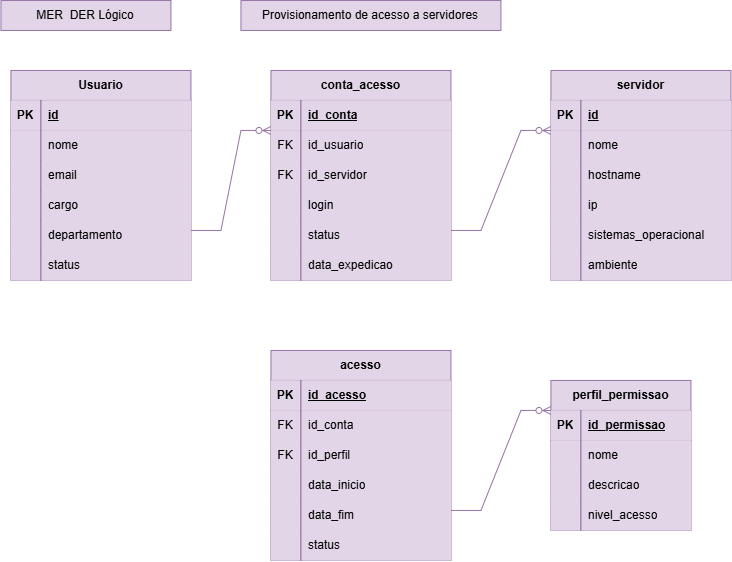
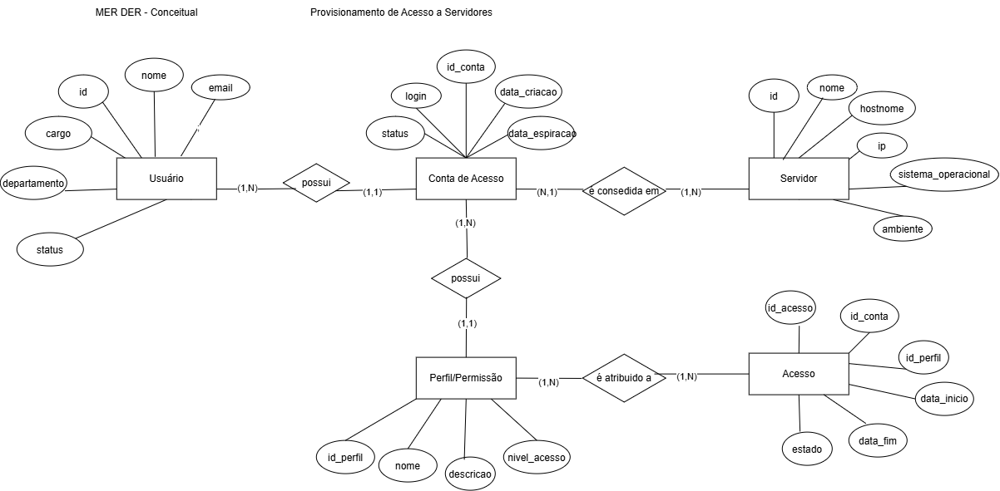

# Prova-Desafio Banco de Dados

## Desafio 3




## Dicionário de Dados
| Entidade | Atributo | Tipo | Tamanho | Descrição |
|-|-|-|-|-|
| Usuario | id | Inteiro | 11 | Identificador, PK, Auto incrementável |
| Usuario | nome | Texto | 100 | Nome do usuário |
| Usuario | email | Texto | 100 | E-mail do usuário |
| Usuario | cargo | Texto | 50 | Cargo do usuário |
| Usuario | departamento | Texto | 50 | Departamento do usuário |
| Usuario | status | Texto | 20 | Status do usuário (ex: Ativo, Inativo) |
| Servidor | id | Inteiro | 11 | Identificador, PK, Auto incrementável |
| Servidor | nome | Texto | 100 | Nome do servidor |
| Servidor | hostname | Texto | 50 | Hostname do servidor |
| Servidor | ip | Texto | 50 | Endereço IP do servidor |
| Servidor | sistema_operacional | Texto | 50 | Sistema operacional do servidor |
| Servidor | ambiente | Texto | 50 | Ambiente do servidor (ex: Desenvolvimento, Testes, Produção) |
| Conta | id_conta | Inteiro | 11 | Identificador, PK, Auto incrementável |
| Conta | id_usuario | Inteiro | 11 | Identificador do usuário, FK referenciando Usuario (id) |
| Conta | id_servidor | Inteiro | 11 | Identificador do servidor, FK referenciando Servidor (id) |
| Conta | login | Texto | 50 | Login da conta |
| Conta | status | Texto | 20 | Status da conta (ex: Ativa, Inativa) |
| Conta | data_criacao | Data | 10 | Data de criação da conta |
| Conta | data_expiracao | Data | 10 | Data de expiração da conta |
| Perfil | id_perfil | Inteiro | 11 | Identificador, PK, Auto incrementável |
| Perfil | nome | Texto | 50 | Nome do perfil (ex: Leitura, Operador, Desenvolvedor, Administrador, DBA, Auditor) |
| Perfil | descricao | Texto | 255 | Descrição do perfil de acesso |
| Perfil | nivel_acesso | Inteiro | 11 | Nível numérico de acesso do perfil |
| Acesso | id_acesso | Inteiro | 11 | Identificador, PK, Auto incrementável |
| Acesso | id_conta | Inteiro | 11 | Identificador da conta, FK referenciando Conta (id_conta) |
| Acesso | id_perfil | Inteiro | 11 | Identificador do perfil, FK referenciando Perfil (id_perfil) |
| Acesso | data_inicio | Data | 10 | Data de início do acesso |
| Acesso | data_fim | Data | 10 | Data de término do acesso |
| Acesso | status | Texto | 20 | Status do acesso (ex: Ativo, Expirado, Revogado) |


## Dados em CSV: 
- 
- 
- 
- 
- 

## DDL:

```
CREATE TABLE perfil_permissao (
    id_perfil INT AUTO_INCREMENT PRIMARY KEY,
    nome VARCHAR(100) NOT NULL,
    descricao VARCHAR(255),
    nivel_acesso INT NOT NULL
);

CREATE TABLE acesso (
    id_acesso INT AUTO_INCREMENT PRIMARY KEY,
    id_conta INT NOT NULL,
    id_perfil INT NOT NULL,
    data_inicio DATE NOT NULL,
    data_fim DATE,
    status VARCHAR(20) NOT NULL,

    FOREIGN KEY (id_conta) REFERENCES conta_acesso(id_conta),
    FOREIGN KEY (id_perfil) REFERENCES perfil_permissao(id_perfil)
);
```
## DML: 
```
USE gestao_acessos_ti;

INSERT INTO usuario
(nome, email, cargo, departamento, status)
VALUES
('João Silva', 'joao@empresa.com', 'Desenvolvedor', 'TI', 'Ativo'),
('Maria Souza', 'maria@empresa.com', 'Analista de Sistemas', 'TI', 'Ativo'),
('Carlos Oliveira', 'carlos@empresa.com', 'Administrador de Redes', 'Infraestrutura', 'Ativo'),
('Ana Santos', 'ana@empresa.com', 'Estagiária', 'TI', 'Ativo');

INSERT INTO servidor
(nome, hostname, ip, sistema_operacional, ambiente)
VALUES
('Servidor Desenvolvimento', 'SRV-DEV-01', '192.168.1.10', 'Ubuntu Server 24.04', 'Desenvolvimento'),
('Servidor Testes', 'SRV-TEST-01', '192.168.1.20', 'Windows Server 2022', 'Testes'),
('Servidor Produção', 'SRV-PROD-01', '192.168.1.30', 'Ubuntu Server 24.04', 'Produção');

INSERT INTO perfil_permissao
(nome, descricao, nivel_acesso)
VALUES
('Leitura', 'Permite apenas visualizar arquivos e informações', 1),
('Operador', 'Permite visualizar e executar operações', 2),
('Administrador', 'Permite acesso completo ao servidor', 3);

INSERT INTO conta_acesso
(id_usuario, id_servidor, login, status, data_criacao, data_expiracao)
VALUES
(1, 1, 'joao.silva', 'Ativa', '2026-09-01', NULL),
(2, 2, 'maria.souza', 'Ativa', '2026-09-05', NULL),
(3, 3, 'carlos.oliveira', 'Ativa', '2026-09-10', NULL),
(4, 1, 'ana.santos', 'Ativa', '2026-09-15', '2026-12-15');

INSERT INTO acesso
(id_conta, id_perfil, data_inicio, data_fim, status)
VALUES
(1, 2, '2026-09-01', NULL, 'Ativo'),
(2, 1, '2026-09-05', NULL, 'Ativo'),
(3, 3, '2026-09-10', NULL, 'Ativo'),
(4, 1, '2026-09-15', '2026-12-15', 'Ativo');
```
